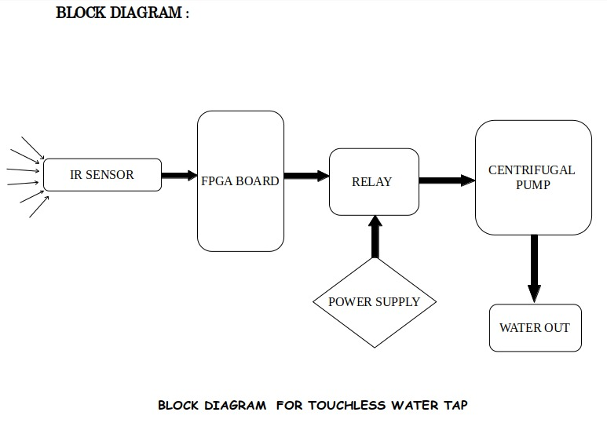

# 🚰 Touchless Water Tap System Using FPGA

 <!-- Replace with actual image path -->

## Overview

This project implements a **Touchless Water Tap System** using **FPGA and Verilog HDL**, aimed at promoting hygiene by eliminating the need for physical contact. The system uses an **IR proximity sensor** to detect the presence of a hand. If a hand is detected for **at least 1 second**, a **centrifugal pump** is activated to dispense water. Once the hand is removed, the pump remains ON for an additional **2 seconds** to ensure smooth operation and avoid wear caused by frequent switching.

This design is ideal for smart public utilities, bathrooms, hospitals, or anywhere contactless interaction is beneficial.

---

## 🔧 Features

- 🚫 **Touchless Operation** using IR Sensor  
- ⏱️ **1-second detection delay** to avoid false triggering  
- 🕒 **2-second hold time** after sensor deactivation for smoother water flow  
- ⚙️ **FPGA-controlled pump activation** using Verilog  
- 🔌 **Centrifugal Pump** controlled via Relay  
- 🔄 **Debounced and glitch-free control logic**  
- 🔐 **Protects the pump** from rapid on/off switching  

---

## 🧠 Working Principle

1. The IR sensor continuously monitors for hand presence.
2. If a hand is detected **for 1 second or more**, the FPGA sends a signal to activate the pump.
3. The pump **remains ON** as long as detection continues.
4. Once the detection stops, a **2-second timer** ensures the pump remains ON briefly before shutting off.
5. This ensures **smooth water flow**, avoids motor damage, and improves overall system performance.

---

## 📦 Components Used

- IR Proximity Sensor Module  
- Centrifugal Water Pump  
- Relay Module   
- FPGA Development Board (e.g., Xilinx Spartan-6 / Intel Cyclone IV)  
- 5V/12V Power Supply  
- Verilog HDL for logic design  
- Simulation tools like **Vivado**

---

## 🛠️ Tools & Technologies

- Verilog HDL  
- Xilinx Vivado  
- FPGA Board  
- Basic Digital Design principles  

---

## 📷 System Block Diagram

  
*Note: Replace this with your actual system block diagram or a photo of your hardware setup.*

---

## ✅ Future Improvements

- Add automatic timeout if the sensor remains active too long  
- Support multiple sensors for multi-tap systems  
- Integrate water flow sensors for precision control  
- Use low-power FPGAs for better energy efficiency  

---

---

## 🤝 Contributing

Pull requests are welcome! For major changes, please open an issue first to discuss what you'd like to change.

---

## 📜 License

This project is open-source and available under the [MIT License](LICENSE).

---

## 🙌 Acknowledgements

Special thanks to SSIT Mentor TEJESH Sir and peers who provided feedback and support throughout the project.

